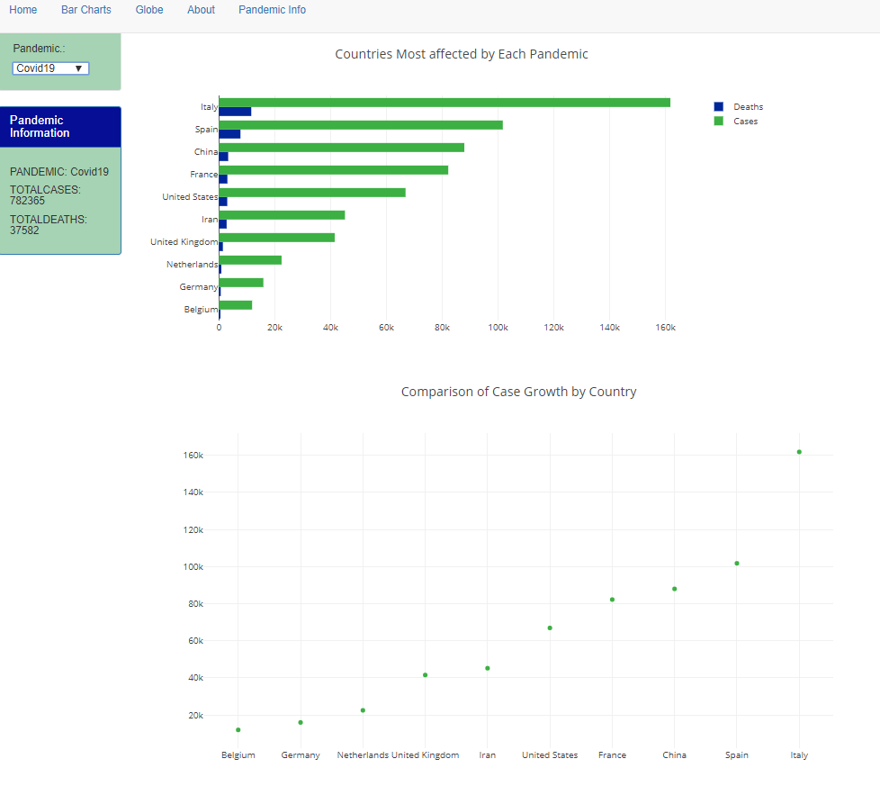

# project2_pandemic_final
## The Task
1. Use a Python Flask–powered RESTful API, HTML/CSS, JavaScript, and one database:  SQLite. 
2. Make a dashboard page with multiple charts that update from the same data : Globe, Bar, Line  
3. Use a JS library that we did not cover in class:  PlanetaryJS
4. Ensure Visualizations are powered by  data sets with at least 100 records. : Multiple Pandemics & Centeroids for Plotting 195 Countries 
5. User-driven interaction: dropdowns & Menu Bar to view about page / pandemic info / charts 
6. Final visualization should ideally include at least three views. : Bar Chart, Bubble Chart and Globe 

### Dataset
1. spanishflu_data - https://ourworldindata.org/spanish-flu-largest-influenza-pandemic-in-history
2. Swineflu_data - https://www.kaggle.com/de5d5fe61fcaa6ad7a66/pandemic-2009-h1n1-swine-flu-influenza-a-dataset
3. Ebola - https://www.kaggle.com/imdevskp/ebola-outbreak-20142016-complete-dataset (we added possible, suspected to the confirmed deaths)
4. Covid - https://www.kaggle.com/sudalairajkumar/novel-corona-virus-2019-dataset#covid_19_data.csv

### Dataset for Population & Plotting on Map 

1. United Nations:  https://population.un.org/wpp/Download/Standard/Population/
2. Centeroids Data - https://worldmap.harvard.edu/data/geonode:country_centroids_az8 

### ETL PROCESS 

1. We used JupyterNotebook to clean the data and use the Case numbers, Deaths, Year, Country and Merge it with Centeroids for Plotting as well as Merging it will Global Population Data for Analysis of % Affected. We used a Jupyter Notebook for Each Pandemic and then had it generate a CSV file that was clean, then we imported, the now clean csv files into a new notebook called 
 
2. We imported dependancies needed to convert this into a sqlite database named pandemic_data.sqlite from jupyter notebook 
 
3. We made our flask app and renamed it to pandemic_final.db - we did this to make sure we knew which was was the final. 
 
4. We used pandas to jsonify and due to the commas, we had originally converted strings to numbers using pandemic-converter.js file but later used pandas to read it and knew to convert them numbers with commas into intergers. 
 
5. We routed our app.js file (JavaScript) to the Flask app.py 
 
6. We connected our HTML file to the routes from the Flask app.py 
 
7. We access the dashboard to see the Visualizations by running the python app.py file
 
#### MENU BAR TO ACCESS BAR CHARTS  
These Change as you select the drop down 

These Change as you select the drop down 
#### MENU BAR TO ACCESS GLOBE 
** There is a delay when running these so we have taken a screenshot of the corresponding globe image

 
 
 
 
